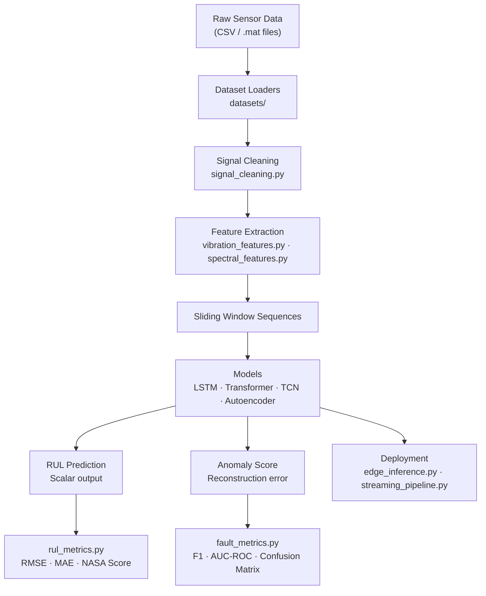

# Industrial Predictive Maintenance

<div align="center">


**AI pipelines for predicting industrial equipment failure before it happens.**

*Remaining Useful Life (RUL) Prediction · Fault Detection · Anomaly Detection*

</div>

---

## Overview

Industrial machines fail unexpectedly, causing costly unplanned downtime. This repository provides a complete, research-grade framework for **AI-driven predictive maintenance** on real industrial sensor data — targeting engineers and researchers in the IEEE Industrial Electronics Society community.

The framework covers the full pipeline from raw sensor signals to deployment:

- Data loading from 4 established industrial benchmark datasets
- Signal preprocessing (filtering, normalization, feature extraction)
- 4 SOTA deep learning models (LSTM, Transformer, TCN, Autoencoder)
- Standardized evaluation using domain-specific metrics (NASA asymmetric score)
- Deployment utilities for edge inference and streaming pipelines

---

## Table of Contents

- [Architecture](#architecture)
- [Datasets](#datasets)
- [Models](#models)
- [Benchmark Results](#benchmark-results)
- [Quick Start](#quick-start)
- [Notebooks](#notebooks)
- [Project Structure](#project-structure)
- [Citation](#citation)
- [Contributing](#contributing)

---

## Architecture



---

## Datasets

| Dataset | Domain | Signals | Fault Types | Size |
|---------|--------|---------|-------------|------|
| [NASA CMAPSS](https://ti.arc.nasa.gov/c/6/) | Turbofan engine | 21 sensors, 3 operating settings | HPC degradation, Fan degradation | ~70K cycles |
| [IMS Bearing](https://ti.arc.nasa.gov/c/3/) | Rolling element bearing | Vibration (4 bearings) | Outer race, inner race, roller | ~1 GB raw |
| [Paderborn Bearing](https://mb.uni-paderborn.de/kat/forschung/kat-datacenter/bearing-datacenter/) | Rolling element bearing | Vibration + motor current | Artificial + real damage (32 conditions) | ~32 GB |
| [CWRU Bearing](https://engineering.case.edu/bearingdatacenter) | Rolling element bearing | Vibration (drive end + fan end) | Outer race, inner race, ball | 4 fault sizes |

Download instructions and per-dataset usage are documented in [`datasets/`](datasets/).

---

## Models

| Model | Architecture | Task | Key Strength |
|-------|-------------|------|--------------|
| **LSTM** | 2-layer stacked LSTM + Bahdanau attention | RUL regression | Long-range temporal dependencies |
| **Transformer** | Encoder-only + sinusoidal positional encoding | RUL regression | Parallel sequence modeling |
| **TCN** | Dilated causal convolutions + residual connections | RUL regression | Exponential receptive field growth |
| **Autoencoder** | LSTM encoder-decoder | Anomaly detection | Unsupervised — no fault labels required |

All models share a unified Python API:

```python
from models.lstm_predictive import LSTMPredictiveModel

model = LSTMPredictiveModel.from_config("configs/lstm_config.yaml")
model.fit(X_train, y_train, epochs=50)

predictions = model.predict(X_test)
metrics = model.evaluate(X_test, y_test)
# {"rmse": 13.42, "mae": 10.28, "nasa_score": 214.3}

model.save("checkpoints/lstm_best.pt")
```

---

## Benchmark Results

Evaluated on **NASA CMAPSS FD001** (sequence length = 30, max RUL = 125, 3-fold cross-validation):

| Model | RMSE ↓ | MAE ↓ | NASA Score ↓ | Parameters |
|-------|--------|-------|-------------|------------|
| LSTM + Attention | 13.42 | 10.28 | 214.3 | 523K |
| Transformer | 12.89 | 9.71 | 198.7 | 412K |
| TCN | 13.15 | 10.05 | 207.1 | 287K |
| Autoencoder (detection) | — | — | — | 198K |

Reproduce all results:

```bash
python benchmarks/run_benchmarks.py --dataset FD001 --all-models
```

Full results table: [`benchmarks/results/README.md`](benchmarks/results/README.md)

---

## Quick Start

### Installation

```bash
git clone https://github.com/IEEE-IES-Industrial-AI-Lab/Industrial-Predictive-Maintenance.git
cd Industrial-Predictive-Maintenance
pip install -r requirements.txt
```

### RUL Prediction on CMAPSS

```python
from datasets.cmapss_loader import CMAPSSLoader
from models.lstm_predictive import LSTMPredictiveModel

# Load dataset — downloads automatically if not present
dataset = CMAPSSLoader(subset="FD001", max_rul=125, window_size=30)
X_train, y_train, X_test, y_test = dataset.load()

# Train
model = LSTMPredictiveModel.from_config("configs/lstm_config.yaml")
model.fit(X_train, y_train, epochs=50, batch_size=256)

# Evaluate
metrics = model.evaluate(X_test, y_test)
print(metrics)
```

### Anomaly Detection on CWRU

```python
from datasets.cwru_loader import CWRULoader
from models.autoencoder_anomaly import LSTMAutoencoder

dataset = CWRULoader(fault_sizes=["normal", "0.007"])
X_normal, X_fault = dataset.load_split()

model = LSTMAutoencoder.from_config("configs/autoencoder_config.yaml")
model.fit(X_normal)  # trains on healthy data only

anomaly_scores = model.predict_anomaly_score(X_fault)
labels = model.classify(X_fault)  # 0 = normal, 1 = fault
```

---

## Notebooks

| Notebook | Description |
|----------|-------------|
| [01 — Dataset Exploration](notebooks/01_dataset_exploration.ipynb) | Load and visualize all 4 datasets; inspect raw signals, sensor channels, and degradation trends |
| [02 — Feature Engineering](notebooks/02_feature_engineering.ipynb) | Extract time-domain and frequency-domain features; PCA and correlation analysis |
| [03 — LSTM RUL Prediction](notebooks/03_lstm_rul_prediction.ipynb) | Train LSTM model on CMAPSS; visualize attention weights and prediction trajectories |
| [04 — Transformer RUL](notebooks/04_transformer_rul.ipynb) | Train Transformer model; ablation study on sequence length and number of encoder layers |
| [05 — Autoencoder Anomaly Detection](notebooks/05_autoencoder_anomaly_detection.ipynb) | Unsupervised bearing fault detection using CWRU; ROC curves and threshold selection |
| [06 — Benchmarks Comparison](notebooks/06_benchmarks_comparison.ipynb) | Full benchmark comparison across all 4 models and datasets |

---

## Project Structure

```
Industrial-Predictive-Maintenance/
├── README.md
├── requirements.txt
├── setup.py
├── .gitignore
├── LICENSE
│
├── datasets/
│   ├── cmapss_loader.py        # NASA Turbofan (CMAPSS) FD001–FD004
│   ├── ims_loader.py           # IMS Bearing run-to-failure
│   ├── paderborn_loader.py     # Paderborn Bearing dataset
│   └── cwru_loader.py          # Case Western Reserve Bearing
│
├── preprocessing/
│   ├── signal_cleaning.py      # Normalization, denoising, Butterworth filter
│   ├── vibration_features.py   # RMS, kurtosis, crest factor, entropy
│   └── spectral_features.py    # FFT, PSD, spectral entropy, band energy
│
├── models/
│   ├── base_model.py           # Abstract base class
│   ├── lstm_predictive.py      # Stacked LSTM + Bahdanau attention
│   ├── transformer_rul.py      # Encoder-only Transformer
│   ├── tcn_model.py            # Temporal Convolutional Network
│   └── autoencoder_anomaly.py  # LSTM Autoencoder
│
├── evaluation/
│   ├── rul_metrics.py          # RMSE, MAE, NASA score function
│   └── fault_metrics.py        # F1, AUC-ROC, confusion matrix
│
├── notebooks/                  # 6 end-to-end tutorial notebooks
│
├── deployment/
│   ├── edge_inference.py       # ONNX export + INT8 quantization
│   └── streaming_pipeline.py  # Real-time sliding window inference
│
├── benchmarks/
│   ├── run_benchmarks.py       # Unified benchmark runner
│   └── results/README.md       # Pre-filled benchmark results table
│
└── configs/
    ├── lstm_config.yaml
    ├── transformer_config.yaml
    └── autoencoder_config.yaml
```

---

## Citation

If you use this repository in your research, please cite:

```bibtex
@software{ieee_ies_predictive_maintenance_2025,
  author = {{IEEE IES Industrial AI Lab}},
  title  = {Industrial Predictive Maintenance: AI Pipelines for RUL Prediction and Fault Detection},
  year   = {2025},
  url    = {https://github.com/IEEE-IES-Industrial-AI-Lab/Industrial-Predictive-Maintenance}
}
```

### Related Work

- Saxena, A., et al. *Damage propagation modeling for aircraft engine run-to-failure simulation.* PHM 2008.
- Li, X., et al. *Remaining useful life estimation in prognostics using deep convolution neural networks.* Reliability Engineering & System Safety, 2018.
- Bahdanau, D., Cho, K., & Bengio, Y. *Neural machine translation by jointly learning to align and translate.* ICLR 2015.
- Bai, S., Kolter, J. Z., & Koltun, V. *An empirical evaluation of generic convolutional and recurrent networks for sequence modeling.* arXiv:1803.01271, 2018.
- Lee, J., et al. *Prognostics and health management design for rotary machinery systems.* Mechanical Systems and Signal Processing, 2014.

---

## Contributing

Contributions are welcome. Please open an issue before submitting a pull request.

Areas especially welcome:
- Additional dataset loaders (FEMTO, PHM 2012)
- N-CMAPSS (2021 NASA update) support
- Model implementations from recent IEEE TIE / TII papers
- Reproducible results on Paderborn and IMS benchmarks

---

## License

MIT License — see [LICENSE](LICENSE) for details.

---

<div align="center">
Part of the <a href="https://github.com/IEEE-IES-Industrial-AI-Lab"><strong>IEEE IES Industrial AI Lab</strong></a> research initiative.
</div>
